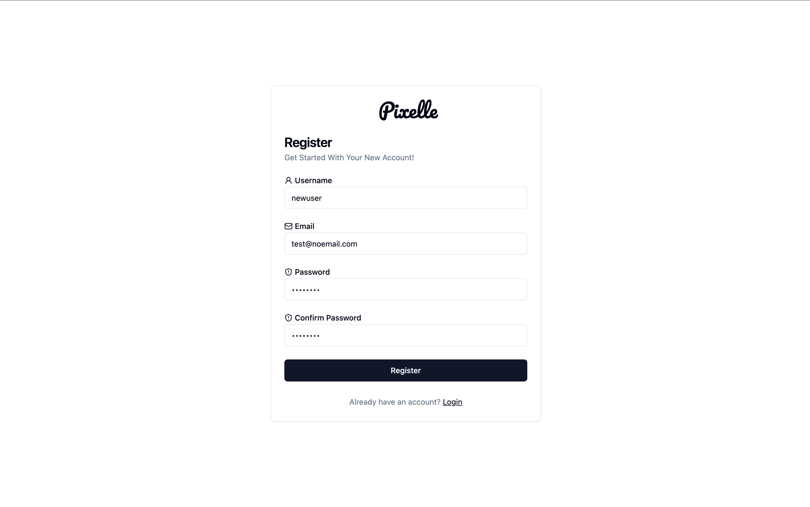
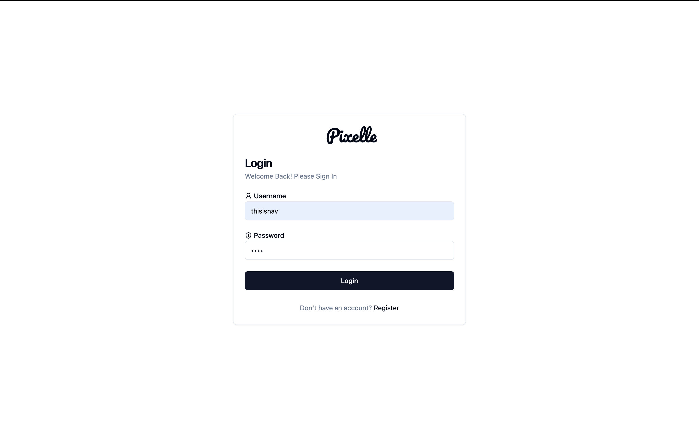
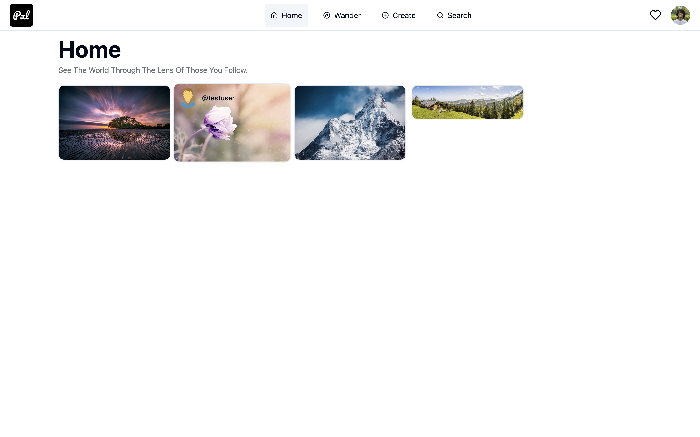
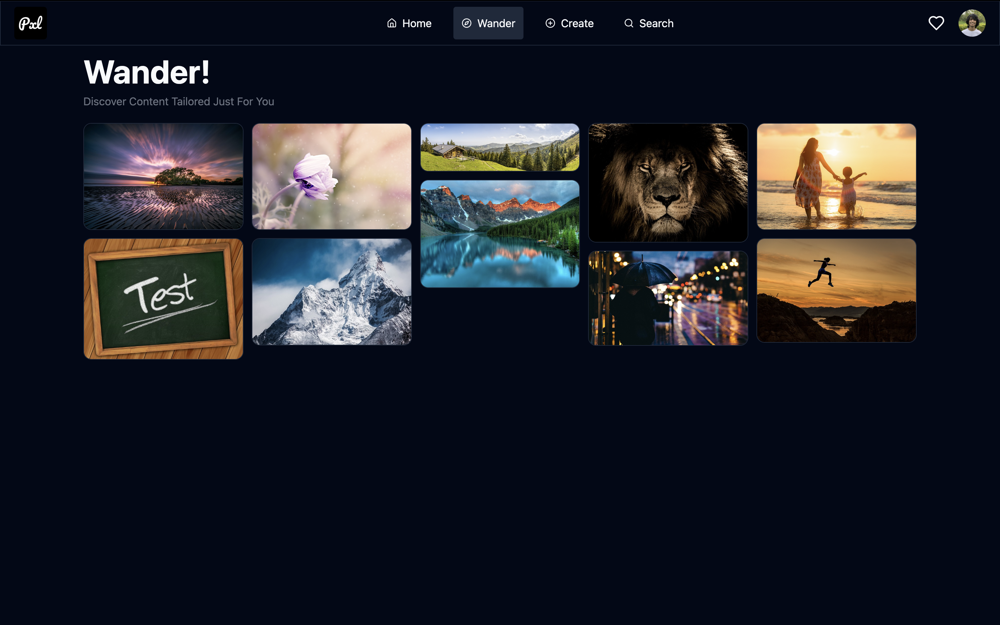
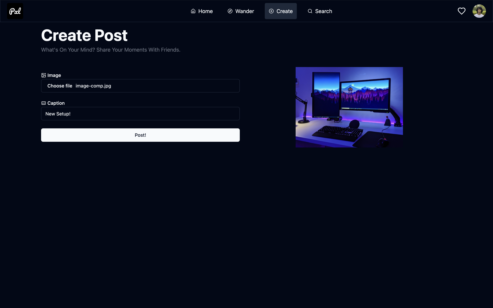
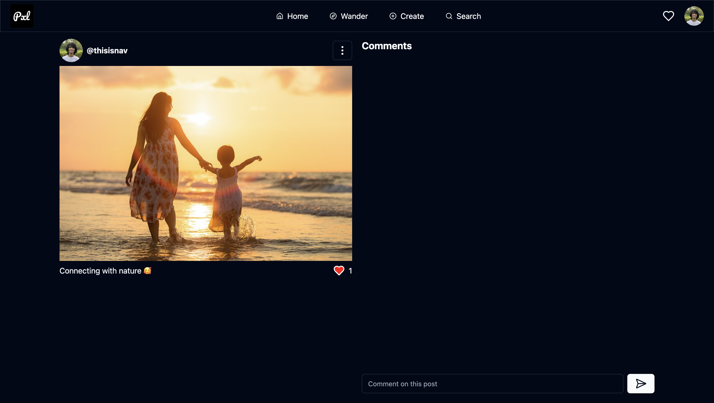
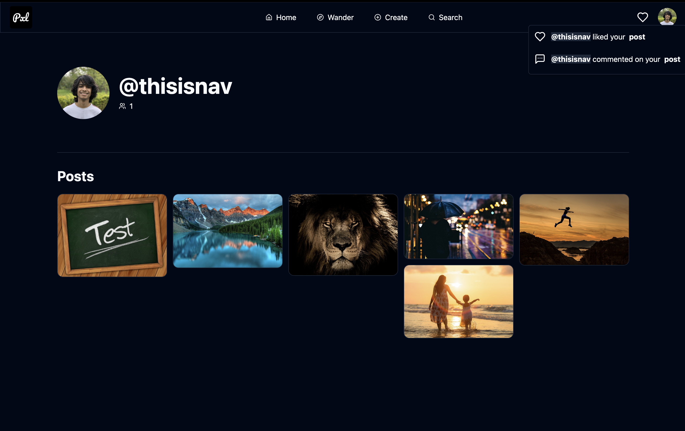

<!-- Header -->
<div align="center">
    
    <br/>
    <h1>Pixelle</h1>
</div>

Pixelle is a modern photo-sharing app that allows users to share, like, and comment on photos, explore new content, and connect with others in an interactive and engaging way.

<!-- Screenshots -->

## Screenshots

<div align="center">
    
    
    
    
    
    
    
</div>

<!-- Features -->

## Features

-   **Post & Share**: Upload and showcase your favorite photos.
-   **Like & Comment**: Engage with posts by liking and leaving comments.
-   **Follow & Connect**: Follow users to stay updated with their latest posts.
-   **Responsive Design**: Seamlessly works across all devices.
-   **Theme Support**: Toggle between light and dark themes.

<!-- Technologies Used -->

## Tech Stack

<div align="center">
    
    
    
    
    
    
    
    
</div>

<!-- Project Setup -->

## Project Setup

Before starting, ensure you have the following installed and configured:

-   **Node.js**: Version 16.x or later.
-   **npm**: Comes with Node.js, or use Yarn if preferred.
-   **AWS Account**: Required for S3 and RDS setup.

Refer to the following links to setup the frontend and backend

-   [Frontend Setup](./frontend/README.md)
-   [Backend Setup](./backend/README.md)

<!-- Contributing -->

## Contributing

We welcome contributions to Pixelle! Here's how you can get involved:

1.  **Fork the Repository**  
    Click the "Fork" button at the top-right corner of this page to create your own copy of the repository.

2.  **Clone the Repository**  
    Clone your forked repository to your local machine:

```bash
git clone https://github.com/ArnavGuptaaa/pixelle.git
cd pixelle
```

3.  **Create a New Brach**  
    Create a branch for your feature or bug fix

```bash
git checkout -b feature/your-feature-name
```

4.  **Make Changes**  
    Implement your changes and test them thoroughly.

5.  **Commit and Push**  
    Commit your changes with a descriptive message and push to your branch

```bash
git add .
git commit -m "Add feature: your-feature-name"
git push origin feature/your-feature-name
```

6.  **Open a Pull Request**  
    Open a pull request to the main repository with a detailed description of your changes.

<!-- Issues -->

## Issues

Found a bug or have a feature request? Let us know!

1. Navigate to the [Issues](https://github.com/ArnavGuptaaa/pixelle/issues) section.
2. Click on "New Issue" and choose whether it's a **Bug Report** or **Feature Request**.
3. Fill out the provided template with as much detail as possible.

We’ll review your issue promptly and work to address it.

---

<div align="center">
    Made with ♥️ by 
    <a href="https://github.com/ArnavGuptaaa">Nav</a>.
</div>
